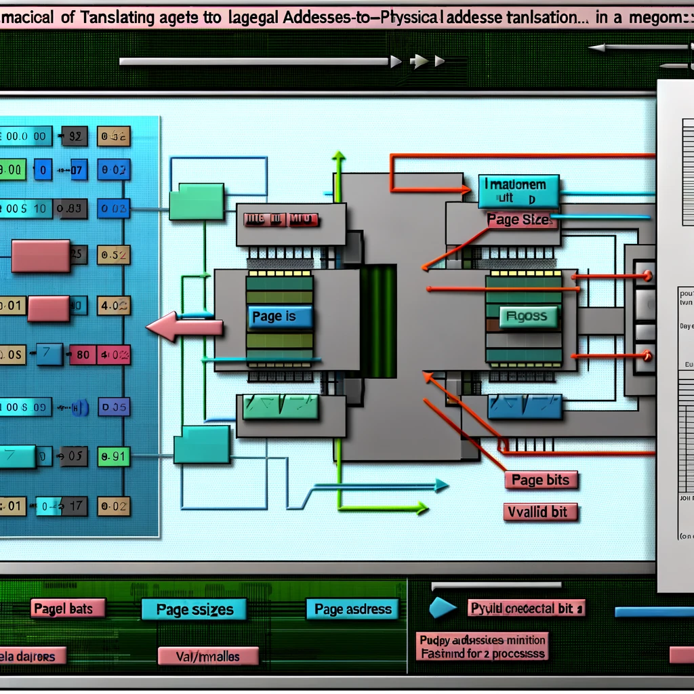

# PagedMemoryManagementSimulator

This code simulates a Memory Management Unit (MMU) for understanding the logical-to-physical address translation in a paged memory system. It features a simulation environment that includes 4K page sizes, 15-bit logical, and 24-bit physical addresses for two processes, each with their own page table. The implementation uses bitwise operations to navigate through pages and offsets, translating logical addresses into physical ones based on the page table entries. It introduces a valid/invalid bit mechanism to manage page utilization effectively, setting a 'fault' flag when accessing an invalid page. This simulation is a practical tool for exploring the intricacies of memory management in operating systems.